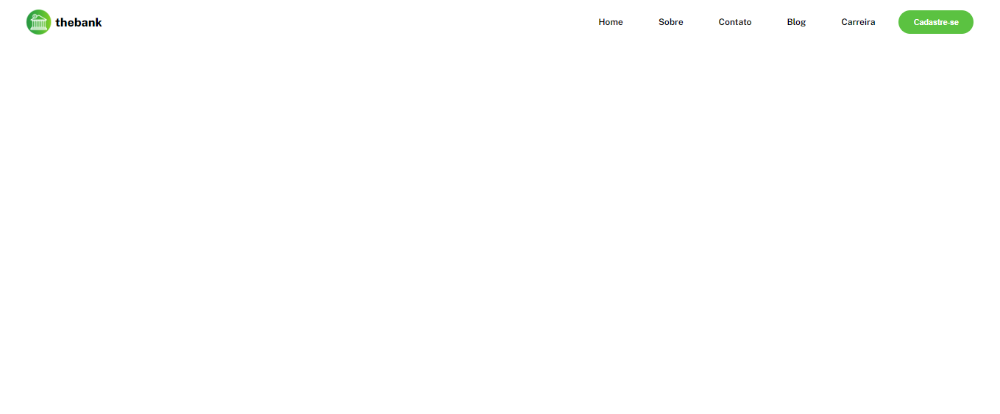

# Todas as resoluções de cada exercicio passado pelo curso Dev em Dobro:
    <a href="#primeiro">1º Cartão de perfil </a>
    <a href="#segundo">2º Gerador de conselhos </a>
    <a href="#terceiro">3º Menu Flexbox </a>
    <a href="#quarto">4º Lista de imagens </a>

<h2 id="primeiro"> 1º Cartão de perfil:</h2>

## Exercicio para teste das habilidades com display flex.

## Visualização em desktop:

## Visualização em mobile:

<h2 id="segundo"> 2º Gerador de conselhos:</h2>

## - Segundo exercício de treinamento com o display flex 

## Tela para desktop:

### Tela para mobile:

### Ativação do botão ao passar o mouse:

<h2 id="terceiro"> 3º Menu flexbox</h2>

## - Exercicio 3 menu com flexbox

## Desktop:

## Mobile:

<h2 id="quarto"> 4º Lista de imagens</h2>

## - Exercício 4 listar imagens na horizontal e vertical

## Horizontal:

## Vertical:

